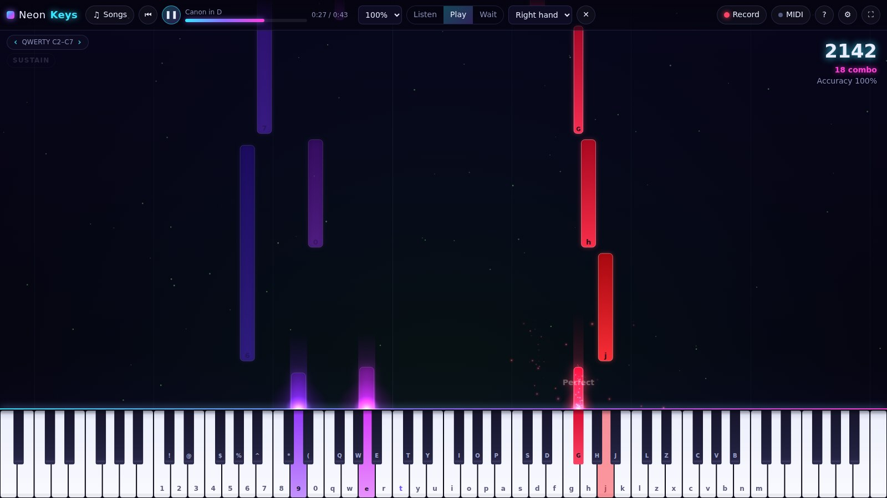

# NeonKeys

**A neon piano and music visualizer for Windows (and the browser).** You can play it with a MIDI keyboard or your computer keyboard. It has falling-note practice modes, records your playing to MIDI, and plays a sampled concert grand.

[Русская версия](README.ru.md)




## Features

- **Three ways to play.** A MIDI keyboard over USB or Bluetooth, with velocity and sustain pedal and hot-plugging. A computer keyboard using the virtual-piano layout that PianoGlow also uses. Mouse or touch, with glissando.
- **Real piano sound.** Two velocity layers of the Salamander Grand Piano, with damper behaviour and sympathetic top octaves. There is also an FM electric piano and a "neon" synth, plus a convolution hall reverb.
- **Visualizer.** Notes rise as glowing bars. Particles move faster when you play faster, the background reacts to the audio, and a light beam shines over each pressed key.
- **Falling notes and practice.** Open any `.mid` file (drag and drop works) or pick one of the built-in public-domain pieces. Three modes:
  - *Listen*: autoplay.
  - *Play*: the notes of your part are judged Perfect, Great, Good or Miss, with combo, score and a grade at the end.
  - *Wait*: the song pauses until you press the right keys.
  - You can play one hand while the app plays the other, at 25–150% speed.
- **Recording.** Record your playing, including the pedal. Export it as a standard `.mid` file, or load the take back to practise it.
- **Key labels.** QWERTY letters or note names on the keys and on the falling notes.
- **Languages.** English and Russian UI, chosen automatically.

## Controls

| Input | Action |
| --- | --- |
| `1`–`0`, `Q`–`P`, `A`–`L`, `Z`–`M` | White keys C2–C7 (`T` is middle C) |
| `Shift` + key | Black key above |
| `←` / `→` | Shift the QWERTY range by an octave |
| `Space` | Sustain pedal |
| MIDI keyboard | Notes with velocity, CC64 sustain |
| `F11` (desktop) | Fullscreen |

Keys are matched by physical position (`KeyboardEvent.code`), so the layout also works on AZERTY, QWERTZ and Russian ЙЦУКЕН keyboards.

## Download (Windows)

Every push builds a Windows installer and a portable `.exe` in GitHub Actions. You can find them under the **NeonKeys** workflow → *Artifacts*. A tag named `neonkeys-v*` (for example `neonkeys-v0.1.0`) publishes them as a GitHub Release.

## Development

```bash
cd neon-keys
npm install
npm run dev            # web version with hot reload (http://localhost:5173)
npm run desktop:dev    # Electron window on top of the dev server (run `npm run dev` first)
npm run desktop        # build + run the desktop app
npm test               # unit tests (Vitest)
npm run dist:win       # Windows installer + portable exe → release/
```

## Architecture

```
src/
  audio/      AudioEngine (voice management, sustain, reverb, analyser) + instruments
  core/       Player (transport, lookahead scheduling, judging), Recorder, Settings
  midi/       Standard MIDI File parser and writer (no dependencies)
  music/      Notes, Song model, demo pieces in a tiny text notation
  input/      QWERTY layout
  render/     Canvas 2D renderer, keyboard geometry, particle system
  platform/   Platform interface + WebPlatform / DesktopPlatform
  ui/         i18n
electron/     main process (app:// protocol, permissions, native dialogs) + preload bridge
```

- **Platform layer.** All host-specific code sits behind the `Platform` interface: MIDI access, file dialogs, settings storage and asset URLs. The browser uses `WebPlatform`. The Electron app uses `DesktopPlatform`, which gets native Open/Save dialogs and a settings file in the user profile through a sandboxed preload bridge. Moving to another shell (Tauri, a native MIDI backend) only needs a new `Platform`.
- **Timing.** The render loop runs on `requestAnimationFrame`. Notes are scheduled on the Web Audio clock with a short lookahead, so their timing is sample-accurate and does not depend on the frame rate.
- **Performance.** Glow comes from pre-rendered sprites drawn with additive blending, and the static white keys are cached offscreen. Visible notes are found by binary search, so large MIDI files stay smooth.
- **Security (desktop).** `contextIsolation`, `sandbox` and a strict CSP are on. The app is served from a custom `app://` scheme. Only the MIDI and fullscreen permissions are granted, and navigation away from the app is blocked.

## Tests

`npm test` covers:
- the MIDI parser: running status, tempo changes, the sustain pedal, drum filtering;
- round trips through the MIDI writer;
- the QWERTY mapping;
- the demo scores;
- player judging in Play and Wait modes and playback speed.

## Roadmap

These PianoGlow features are not built yet: online multiplayer rooms, ear/chord/scale training, sheet music view, custom SoundFonts and video export.

## Credits & license

- Code: MIT (see [LICENSE](LICENSE)).
- Piano samples: [Salamander Grand Piano V3](https://archive.org/details/SalamanderGrandPianoV3) by Alexander Holm, CC BY 3.0, via the `@audio-samples/piano-mp3-*` packages.
- Demo pieces: compositions by Petzold, Beethoven, Bach and Pachelbel (public domain), in simplified arrangements.
- Inspired by [PianoGlow](https://pianoglow.com). This is an independent project and is not affiliated with it.
