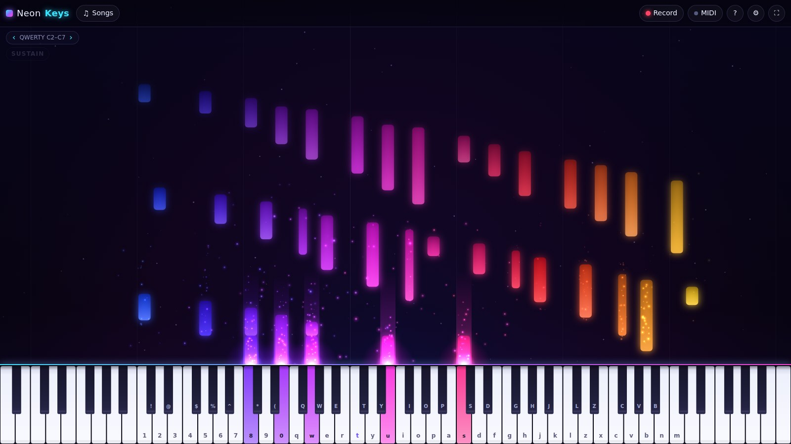

# NeonKeys

**Неоновое пианино и музыкальный визуализатор для Windows (и браузера).** Играть можно на MIDI-клавиатуре или на клавиатуре компьютера. Есть режимы разучивания с падающими нотами, запись игры в MIDI и звук настоящего концертного рояля.

[English version](README.md)



## Возможности

- **Три способа игры.** MIDI-клавиатура по USB или Bluetooth: сила нажатия, педаль сустейна, подключение на лету. Клавиатура компьютера в раскладке «virtual piano», как в PianoGlow. Мышь или касание, с глиссандо.
- **Настоящий звук рояля.** Два слоя силы нажатия Salamander Grand Piano, демпферы, свободно звучащие верхние октавы. Есть также FM-электропиано и «неоновый» синтезатор, плюс ревербератор зала.
- **Визуализатор.** Ноты поднимаются светящимися полосами. Частицы ускоряются, когда играешь быстрее, фон реагирует на звук, над нажатой клавишей горит луч.
- **Падающие ноты и разучивание.** Можно открыть любой `.mid` файл (или перетащить его в окно) или выбрать встроенную пьесу. Три режима:
  - *Слушать* — автоигра.
  - *Играть* — ноты вашей партии оцениваются (Отлично / Хорошо / Неплохо / Мимо), есть комбо, очки и итоговая оценка.
  - *Ожидание* — песня ждёт, пока вы нажмёте нужные клавиши.
  - Можно играть одной рукой, пока приложение играет другую, со скоростью 25–150%.
- **Запись.** Записывает игру вместе с педалью. Запись можно сохранить в `.mid` или загрузить обратно для разучивания.
- **Подписи.** Буквы QWERTY или названия нот на клавишах и на падающих нотах.
- **Язык.** Интерфейс на русском и английском, выбирается автоматически.

## Управление

| Ввод | Действие |
| --- | --- |
| `1`–`0`, `Q`–`P`, `A`–`L`, `Z`–`M` | Белые клавиши C2–C7 (`T` — до первой октавы) |
| `Shift` + клавиша | Чёрная клавиша выше |
| `←` / `→` | Сдвиг QWERTY-диапазона на октаву |
| `Пробел` | Педаль сустейна |
| MIDI-клавиатура | Ноты с силой нажатия, педаль CC64 |
| `F11` (десктоп) | Полный экран |

Клавиши определяются по физическому положению, поэтому раскладка работает и на русской ЙЦУКЕН.

## Скачать (Windows)

Каждый push собирает в GitHub Actions установщик и portable-версию `.exe`. Они лежат в workflow **NeonKeys** → *Artifacts*. Тег вида `neonkeys-v0.1.0` публикует их как GitHub Release.

## Разработка

```bash
cd neon-keys
npm install
npm run dev            # веб-версия с горячей перезагрузкой
npm run desktop        # сборка и запуск десктоп-приложения
npm test               # юнит-тесты
npm run dist:win       # установщик и portable .exe для Windows → release/
```

## Архитектура

Всё, что зависит от среды (MIDI, диалоги файлов, хранение настроек), спрятано за интерфейсом `Platform`. В браузере работает `WebPlatform`, в Electron — `DesktopPlatform`: нативные окна открытия и сохранения и файл настроек в профиле пользователя. Движок, звук и графика у обеих версий общие. Подробности — в [README.md](README.md#architecture).

## Авторство и лицензии

- Код — MIT.
- Сэмплы рояля — Salamander Grand Piano V3, Alexander Holm, CC BY 3.0.
- Демо-пьесы (Петцольд, Бетховен, Бах, Пахельбель) — общественное достояние, в упрощённых аранжировках.
- Проект вдохновлён [PianoGlow](https://pianoglow.com). Это независимая разработка, не связанная с PianoGlow.
